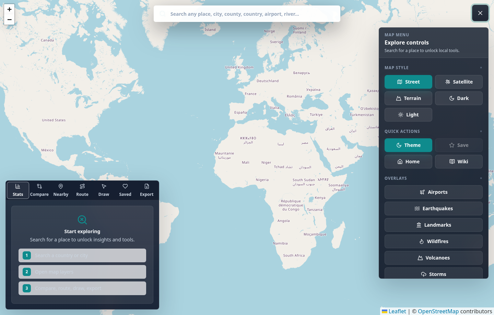

# Gazetteer

Gazetteer is a production-style React map application for exploring almost any named place in the world: countries, counties, states, cities, towns, villages, neighbourhoods, airports, landmarks, schools, hospitals, parks, rivers, lakes, mountains, islands, and other geographic features.

The app is built as a polished portfolio project with a React frontend, an Express API proxy, typed data access, cached API calls, map overlays, local persistence, responsive UI, dark mode, comparison tools, nearby-place discovery, and route planning.

## Screenshot



## Highlights

- Global place search powered by GeoNames feature classes, not just countries.
- Full-screen interactive map with street and satellite layers.
- Support for countries, administrative areas, populated places, sites, buildings, transport locations, water features, landforms, parks, forests, and undersea features.
- Country and place detail panels.
- Weather, multi-day forecast, UV, wind, humidity, sunrise/sunset, and air-quality support.
- Country comparison with population, area, density, GDP, life expectancy, internet usage, CO2, languages, currency, capital, calling code, and domains where available.
- Statistics dashboard with Recharts visualisations.
- Nearby places from OpenStreetMap Overpass, including cafes, restaurants, hotels, hospitals, banks, police, schools, museums, pharmacies, and parks.
- Route planning with OSRM for driving, walking, and cycling profiles.
- Route summary cards, direct flight distance, estimated travel time, turn-by-turn step summaries, and route line rendering on the map.
- Drawing and measurement tools for markers, circles, rectangles, polygons, and point-to-point distances.
- Favorites and recent search history stored locally.
- Street, satellite, terrain, dark, and light map mode switching.
- Airport, landmark, and earthquake overlays.
- NASA EONET disaster overlays for wildfires, volcanoes, storms, and floods.
- Wikipedia integration.
- Dark mode.
- Responsive layout for desktop, tablet, and mobile.
- Toast notifications, loading states, empty states, and controlled API errors.
- Export selected places as JSON, route geometry and drawings as GeoJSON, printable PDF reports, and print-ready map captures.
- Server-side TTL caching, request logging, and API rate limiting.

## Tech Stack

- React 19
- TypeScript
- Vite
- Tailwind CSS
- React Router
- React Leaflet and Leaflet
- TanStack Query
- Zustand with local persistence
- Axios
- Framer Motion
- React Hot Toast
- Recharts
- Lucide React
- Express
- Vitest

## APIs And Data Sources

- GeoNames: global place search, country facts, and Wikipedia landmarks
- WeatherAPI: current weather and forecasts
- Open-Meteo: no-key weather fallback when WeatherAPI credentials fail
- OpenStreetMap: street map tiles and Overpass nearby-place data
- Esri World Imagery: satellite map tiles
- OSRM: route planning
- World Bank: country statistics
- USGS: recent earthquake feed
- NASA EONET: active wildfires, volcanoes, storms, and flood events
- open.er-api.com: exchange rates
- mwgg Airports dataset: airport overlay

## Project Structure

```text
src/
  api/          Typed frontend API functions
  components/   Shared UI, modals, panels, controls
  constants/    Feature labels and lookup data
  features/     Map and search feature modules
  hooks/        Shared React hooks
  layouts/      Route layouts
  pages/        App pages
  store/        Zustand state and persistence
  styles/       Tailwind and global CSS
  tests/        Unit tests
  types/        Shared TypeScript types
  utils/        Geographic helpers
server/
  index.js      Express API proxy and data normalisation
```

## Getting Started

1. Install dependencies:

   ```bash
   npm install
   ```

2. Create your local environment file:

   ```bash
   cp .env.example .env
   ```

3. Fill in the required values:

   ```env
   GEONAMES_USER=your_geonames_username_here
   WEATHER_API_KEY=your_weatherapi_key_here
   ```

4. Start the frontend and backend:

   ```bash
   npm run dev:full
   ```

5. Open:

   ```text
   http://localhost:5173
   ```

## Environment Variables

| Name | Required | Description |
| --- | --- | --- |
| `PORT` | No | Express server port. Defaults to `3001`. |
| `CLIENT_ORIGIN` | No | Allowed CORS origin. Defaults to `http://localhost:5173`. |
| `API_RATE_LIMIT_PER_MINUTE` | No | Per-IP API request limit. Defaults to `120`. |
| `NODE_ENV` | No | Use `production` in deployed environments. |
| `GEONAMES_USER` | Yes | GeoNames username used by backend search, country, and landmark routes. |
| `WEATHER_API_KEY` | Yes | WeatherAPI key used only by the backend. |

## Available Scripts

```bash
npm run dev       # Start Vite frontend
npm run server    # Start Express backend
npm run dev:full  # Start both frontend and backend
npm run lint      # Run ESLint
npm test          # Run Vitest
npm run test:e2e  # Run Playwright end-to-end tests
npm run build     # Type-check and build production assets
```

## Quality Checks

Before publishing or deploying, run:

```bash
npm run lint
npm test
npm run test:e2e
npm run build
npm audit
```

## Docker

Build and run with Docker Compose:

```bash
docker compose up --build
```

The production container serves the API and compiled frontend on:

```text
http://localhost:3001
```

## Security Notes

- API keys are read from environment variables.
- Private keys are not exposed in frontend source.
- `.env.example` intentionally contains placeholders only.
- Third-party calls are proxied through Express.
- User input is bounded or sanitized before being sent to upstream APIs.
- Upstream fetches have timeouts so requests do not hang indefinitely.
- `/api/*` routes are rate-limited.
- Expensive upstream API responses are cached in memory with short TTLs.
- `.env` is gitignored.
- Rotate any credentials that were ever committed, pasted into screenshots, or shared in support conversations before publishing the app.

## Deployment

Run `npm run build` and deploy the generated `dist/` assets with the Express server, or host `dist/` on a static platform and route `/api/*` to the backend. Configure the environment variables above in your production host.

Recommended production setup:

- Rotate GeoNames and WeatherAPI credentials before publishing.
- Set `NODE_ENV=production`.
- Set `CLIENT_ORIGIN` to the deployed frontend origin.
- Tune `API_RATE_LIMIT_PER_MINUTE` for expected traffic.
- Run Express behind HTTPS and a reverse proxy.
- Use host-level logging and error monitoring, such as Sentry, Logtail, or your platform logs.
- Put static assets behind a CDN when traffic grows.
- Run `docker compose up --build` locally before publishing if you plan to ship the container.
- Keep `CLIENT_ORIGIN` locked to the deployed frontend URL and avoid wildcard CORS in production.

## Future Improvements

- Replace in-memory cache with Redis for multi-instance deployments.
- Add provider-backed live flight and marine traffic layers when commercial API credentials are available.
- Add true raster image export with a tile provider that permits CORS-safe canvas capture.
- Add Lighthouse results before publishing the portfolio version.

## License

MIT
